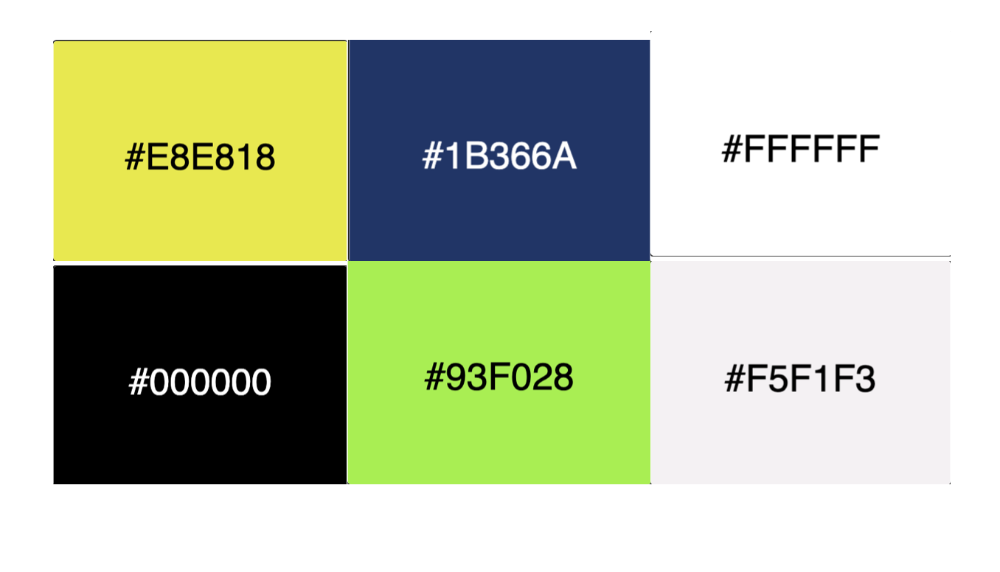

# *FUN LEARN*

Welcome to Fun Learn, the ultimate web app designed to engage and educate young minds! Our app is a treasure trove of alphabet exploration and fun drag-and-drop game. Through interactive activities, kids can dive into the fascinating world of alphabets, mastering letter recognition and sounds.

The heart of Fun Learn lies in its captivating drag-and-drop games. Children get to match colorful images to their corresponding alphabet, enhancing their cognitive abilities and fine motor skills in an enjoyable way. Each game is thoughtfully crafted to ensure a playful learning experience that keeps kids excited and motivated.

With Fun Learn, learning becomes an adventure! Our web app offers a unique blend of entertainment and education, making it the ideal companion for preschoolers and kindergarteners on their journey of early literacy development. Embrace the joy of learning with Fun Learn and watch young minds flourish in the world of alphabets!

The site can be accessed by this [link]( https://jibinjjohny.github.io/project2/)

---
## User Stories
* As a parent, I want my child to have a fun and interactive way to learn alphabets, so I can encourage their early literacy development and make learning enjoyable for them.
* As a kindergarten teacher, I need a web app with engaging drag-and-drop games for alphabets, so I can incorporate interactive activities into my classroom and enhance my students' learning experience.
* As a preschooler, I want to play fun drag-and-drop games with colorful images and letters, so I can improve my letter recognition skills and have a great time learning.
* As a caregiver, I need an educational web app that is easy to use and visually appealing, so I can introduce young children to alphabets and support their learning while keeping them entertained.
* As a developer, I want to create a web app that offers a variety of alphabet-related activities and games, so I can provide a diverse and enriching learning experience for young users.
* As a language educator, I need the web app to provide audio support for letter sounds and pronunciation, so I can assist students in developing their phonics skills.
* As a school administrator, I want the web app to be accessible on various devices, including tablets and smartphones, so students can access it both in school and at home.

## Features

+ ### Menu Page
    - There are 4 buttons on the Menu page:
        1. RULES button which leads to opens modal window with rules of app.
        1. START button, which leads to two other option buttons: the ALPHABETS button and the GAME button.
        1. ALPHABETS button will initially be hidden and will only appear when someone clicks the START button. The button will leads to the Alphabets page.
        1. GAME button will also initially hidden and will only appear when someone click START button.The button will leads to Game page.

        1. The footer has social media links to GitHub and LinkedIn accounts.

           
           
           --------
+ ### Alphabets Page
    1. It has a button in the upper left corner of the screen that takes you to the menu page.
    1. It has a card with two sides.
        - On the front side, there are capital and small letters of the English alphabet.
        - The back side includes the alphabet's appropriate image, words, and a button for          pronouncing the word in a British English accent.
    1. It includes a "next" button that replaces the current letter with another.
    1. The footer has social media links to GitHub and LinkedIn accounts.
    
    
    ---

+ ### Game Page
    1. It has a button in the upper left corner of the screen that takes you to the menu page.
    1. Alphabet Images: Explain that the game displays draggable alphabet images representing different letters.
    1. Word Drop Zones: Describe the drop zones where players can drag the alphabet images to match them with their correct words.
    1.Highlight the game encourages interactive learning through drag-and-drop interactions. The background color of the drop zone changes to green. when you drop the correct image
    1. Random Order: Mention that the alphabet images, words, and sounds are randomized for each round to keep the game engaging.
    1. It has a "Play again" button, which replaces the current images and words."The Play Again" button appears only when three images match the corresponding word in the drop zone."
    1. The footer has social media links to GitHub and LinkedIn accounts.
  
  
  ----

## Technologies Used

- [HTML](https://developer.mozilla.org/en-US/docs/Web/HTML) was used as the foundation of the site.
- [CSS](https://developer.mozilla.org/en-US/docs/Web/css) - was used to add the styles and layout of the site.
- [CSS Flexbox](https://developer.mozilla.org/en-US/docs/Learn/CSS/CSS_layout/Flexbox) - was used to arrange items simmetrically on the pages.
- [Figma](https://www.figma.com/) was used to make wireframes for the website.
- [VSCode](https://code.visualstudio.com/) was used as the main tool to write and edit code.
- [Git](https://git-scm.com/) was used for the version control of the website.
- [GitHub](https://github.com/) was used to host the code of the website.
- [Birme](https://www.birme.net/) was used to reduce the image size.

---
## Design
- The image below represent the overall color scheme used throughout the app.

- The color #E8E818 is a bright yellow shade. Yellow is a highly visible color that naturally draws attention and Yellow is often associated with energy, optimism, and happiness, which can create a positive emotional impact on users.
- Blue is often associated with professionalism, trustworthiness and reliability. By using #1B366A in the design, it can give the web application a sense of credibility, which is essential for building trust with users. 
-  #93F028 is a vibrant and lively green color that exudes energy and positivity. It can be used to add a fresh and dynamic feel to the website, making it more engaging and inviting for users.
-  #F5F1F3 is a clean and neutral color that creates a sense of simplicity and minimalism. It is often used as a background color to provide a subtle and unobtrusive canvas for other elements on the web app.
----

Comic Sans M S:Font was used as the main font of the application to increase the readability of the content on the pages.

-----
## Wireframes
- [Here is the Desktop wireframe](https://github.com/JIBINJJOHNY/project2/blob/main/documents/desktopwireframe.png)
- [Here is the mobile wireframe](https://github.com/JIBINJJOHNY/project2/blob/main/documents/mobilewireframe.png)

----
## Testing
All test related documentation can be found in the [TESTING.md](TESTING.md) file.

-----

## Deployment

- The site has been deployed on GitHub pages. The steps to deploy are as follows:
  - In the [GitHub repository](https://github.com/JIBINJJOHNY/project2), go to the Settings tab.
  - Select **Main** Branch from the Source Section drop-down menu, then click Save.
  - The page will be automatically refreshed with a detailed ribbon display to show that the deployment has been successful.
  - The live link can be found [here](https://jibinjjohny.github.io/project2/).

### Local Deployment
- To create a local copy of this project, you can clone it. In the terminal window of your IDE, type the following command to clone my repository:
  - git clonehttps://github.com/JIBINJJOHNY/project2.git
  - Alternatively, if you are using Gitpod, you can [click here](https://gitpod.io/new#https://github.com/JIBINJJOHNY/project2) to launch your Gitpod working environment.

-----
## Future improvements
- Add Numbers
- Add Add Basic Arithemetic operations.
- Add Add more intresting games.
- add custom 404 page.
- Improve commit message quality (I'm a git bigginer, so not all commits meet standards, but will try to improve in future)

------
## Credits

- Icons were sources from [Font Awesome](https://fontawesome.com/search).
- Background image took from [pxfuel](https://www.pxfuel.com/en/desktop-wallpaper-iwwtp/download/2880x1800).
- Inspiration for the drag and drop game from [Coding Artist](https://www.youtube.com/@CodingArtist) on her YouTube channel.
- Inspiration for the Alphabets card  [Iuliia Konovalova](https://github.com/IuliiaKonovalova) on GitHub.

### Alphabets Images:
[Apple](https://www.google.com/search?rlz=1C5CHFA_enDE951DE951&sxsrf=AB5stBi2Z6SbQSTAQcf38D1hsIKBkIU7Zg:1689800905949&q=apple+fruit&tbm=isch&sa=X&ved=2ahUKEwjQxPX11puAAxVnhv0HHaxyDacQ0pQJegQICRAB&biw=1440&bih=764&dpr=2#imgrc=OgCZEJ9BvXKAIM)
[Ball]( https://www.google.com/search?q=ball&tbm=isch&chips=q:ball,g_1:soccer:rg-9kDU_XCQ%3D&rlz=1C5CHFA_enDE951DE951&hl=en-GB&sa=X&ved=2ahUKEwjDuJO425uAAxVsmycCHSVLDPUQ4lYoAXoECAEQMQ&biw=1440&bih=764#imgrc=4hYw7WauEbWk4M)
[Cat](https://www.google.com/search?q=cat&tbm=isch&ved=2ahUKEwjS5sbg15uAAxXTpUwKHXHhCXAQ2-cCegQIABAA&oq=cat&gs_lcp=CgNpbWcQAzIHCAAQigUQQzIHCAAQigUQQzIHCAAQigUQQzIHCAAQigUQQzIHCAAQigUQQzIHCAAQigUQQzIFCAAQgAQyBQgAEIAEMgcIABCKBRBDMgUIABCABDoECCMQJzoKCAAQigUQsQMQQzoHCCMQ6gIQJ1C6A1izEmDbFGgBcAB4AIABfYgBnQSSAQM3LjGYAQCgAQGqAQtnd3Mtd2l6LWltZ7ABCsABAQ&sclient=img&ei=qVG4ZJLuItPLsgLxwqeABw&bih=764&biw=1440&rlz=1C5CHFA_enDE951DE951#imgrc=4fIvgFkv-TVvaM&imgdii=kkOZneXqMy3cGM)
[Dog](https://www.google.com/search?rlz=1C5CHFA_enDE951DE951&sxsrf=AB5stBifxTVeiFA644VXAFWaKtSZo9zpng:1689809701168&q=dog&tbm=isch&sa=X&ved=2ahUKEwjtlefX95uAAxUT2AIHHb6ECjAQ0pQJegQIDRAB&biw=1440&bih=821&dpr=2#imgrc=Kua2uYskZA9ydM&imgdii=2bypY_ArvTI8xM)
[Elephent](https://rare-gallery.com/843641-elephants-white-background.html)
[Fish](https://www.tankarium.com/colorful-fish/)
[Grape](https://www.freepik.com/premium-vector/isolated-dark-grape-with-green-leaf_14876904.htm)
[Hat](https://www.trendhim.de/piero-hellbrauner-moda-panama-hut-mit-marineblauem-band-p.html?th_source_locale=en-NZ)
[Ice cream](https://www.publicdomainpictures.net/en/view-image.php?image=173856&picture=ice-cream-white-isolated)
[Jug](https://www.rewardhospitality.co.nz/drinkware-and-bar/serving-and-storage/jugs/jug-1-3lt-arc-glass-6)
[Kite](https://www.inthebreeze.com/prod-115-1-10-273/rainbow-30-diamond-kite.htm)
[Leaf](https://www.freepik.com/free-photo/growth-close-up-environmental-lush-natural_1047575.htm#query=leaf&position=3&from_view=keyword&track=sph)
[Monkey](https://www.istockphoto.com/de/foto/gr%C3%BCne-meerkatze-chlorocebus-pygerythrus-gm93214254-6228262?utm_campaign=srp_photos_10&utm_content=https%3A%2F%2Fwww.pexels.com%2Fsearch%2Fmonkey%2F&utm_medium=affiliate&utm_source=pexels&utm_term=monkey)
[Nest](https://de.vecteezy.com/vektorkunst/6762006-vektorbild-eines-vogelnestes-mit-eiern-eps-10)
[Onion](https://www.vecteezy.com/vector-art/1992951-fresh-onion-healthy-vegetable-icon)
[Pen](https://www.bigbasket.com/pd/40290249/uni-ball-click-gel-pen-blue-ink-1-pc/)
[Queen](https://stock.adobe.com/de/images/cute-girl-queen-isolated-female-character-in-a-princess-costume-with-a-crown-and-scepter-on-a-white-background/105898343)
[Rabbit](https://depositphotos.com/28301569/stock-photo-grey-rabbit-on-a-white.html)
[Sun](https://de.vecteezy.com/vektorkunst/551126-sun-symbol)
[Tiger](https://www.vecteezy.com/vector-art/5113014-cute-baby-tiger-cartoon-on-white-background)
[Umbrella](https://stock.adobe.com/search?k=umbrella+clipart&asset_id=125827920)
[Violin](https://www.amazon.com/Hey-Play-Violin-Adjustable-Strings/dp/B08BCSTZ51)
[Watermelon](https://www.walmart.com/ip/Fresh-Personal-Watermelon-Each/44390986)
[Xylophone](https://www.fruugo.de/8-keys-compact-size-xylophone-glockenspiel-with-wooden-mallets-percussion-musical-instrument-toy-gift-for-kids-children/p-151066111-319333927?language=en)
[Yolk](https://www.istockphoto.com/de/foto/raw-eigelb-gm517542714-89544969)
[Zebra](https://www.istockphoto.com/de/vektor/zebra-logo-isoliertes-zebra-auf-wei%C3%9Fem-hintergrund-gm1256855778-368148075)

### Tools
- [Figma](https://www.figma.com/) was used to create the logo.
- [Birme](https://www.birme.net/?target_width=400&target_height=400&auto_focal=false&image_format=webp&quality_jpeg=100&quality_webp=80) was used to resize the size of images.
- [RGBA Color Picker](https://rgbacolorpicker.com/) was used to select suitable color for background.
