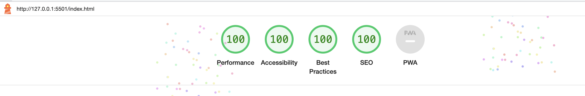

# TESTING

## Compatibilit

To confirm correct functionality, responsiveness and appearance:
- The app has been tested on the following browsers: Chrome, Safari, Firefox.

    - Chrome :

    

    - Safari :

    

    - Firefox :
    

 ## Responsiveness

 - The site has been tested using the devtools that are implemented in Chrome browsers.

## LightHouse report
- With the help of Lighthouse in devtools, I have been able to confirm that the web app functions well, is accessible and that the colours and fonts chosen are readable
    ### Home page

  

   ### Alphabets page

  
     ### Game page

  